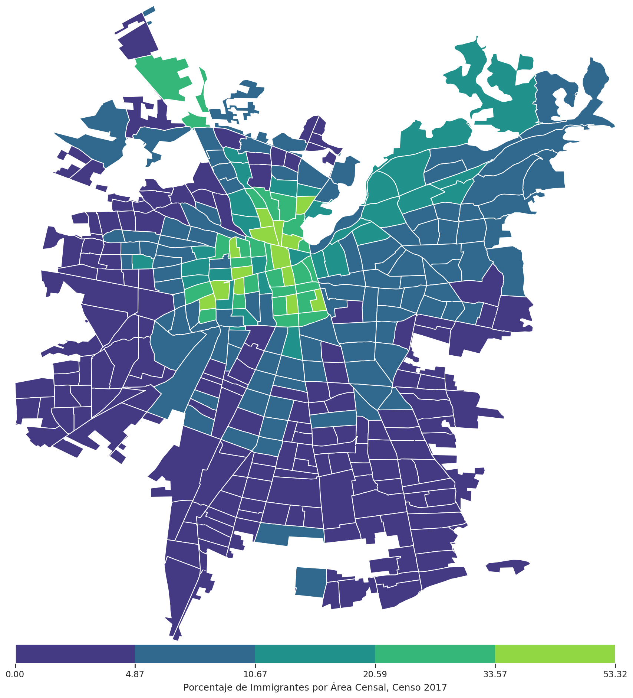

# Análisis Exploratorio de los Microdatos del Censo 2017

Por [**Eduardo Graells-Garrido** (@carnby)](https://twitter.com/carnby), <egraells@udd.cl>

En este repositorio muestro cómo cargar los primeros datos disponibles del Censo 2017 para generar mapas de coropletas. 

Particularmente haremos tres mapas:

  * ¿Cuál es la distribución de les inmigrantes en Santiago? 
  * ¿Cuál es la distribución de las personas mayores de 65 años en Santiago?
  * ¿Dónde viven más hombres o mujeres?

Los datos se han obtenido de las siguientes fuentes (y están incluidos en este repositorio):

  * [Microdatos del Censo 2017](http://www.censo2017.cl/microdatos/)
  * [Shapefile de Distritos Censales](https://github.com/justinelliotmeyers/official_chile_2017_census_boundary_shapefile)
  * [Shapefile de áreas urbanas del país](https://www.bcn.cl/siit/mapas_vectoriales/index_html)

Éste es uno de los mapas, correspondiente a la primera pregunta sobre inmigrantes:

